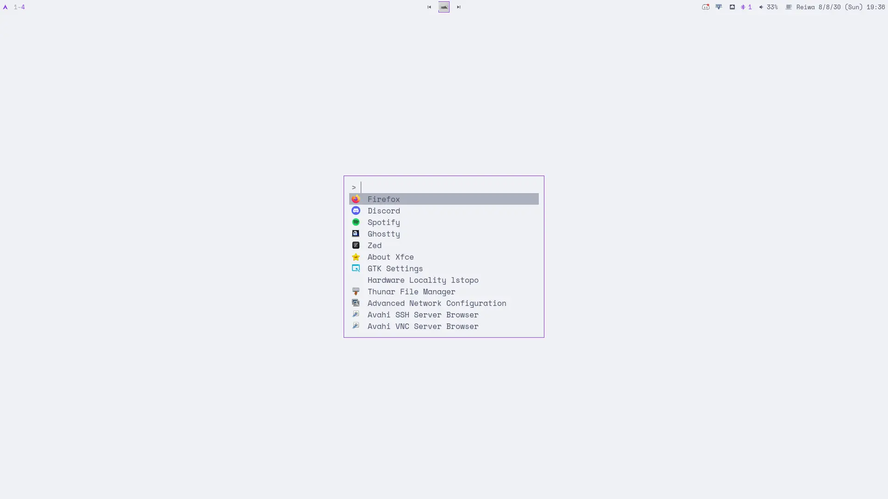

# dotfiles
おはようございます。

## 基本理念
テーマ: Catppuccin Latte Mauve統一を目指す。  
ここは全ての環境のためのdotfiles。「このディストロでだけ良く動けば良い」という自環境中心的な考えで実装しない。

## インストール
```sh
sh -c "$(curl -fsLS https://get.chezmoi.io)" -- init --apply 23236SotaShimada
```

## アップデート
```sh
chezmoi update
```

## スクショ


## todo
### パッケージの変更、追加
- `gnome-keyring` — パスワード・トークン・Secret Service管理
- `hyprpolkitagent` — GUIでのPolkit権限昇格・パスワード入力

### swaync のクイック設定
- 輝度、ネットワーク、音量、Bluetooth の操作を通知センターに集約

### waybarの要素間隔修正
要素ごとに幅や間隔が異って見える。、文字サイズも統一されていないように感じる。

### プライバシインジケータ
- Waybar標準の`privacy`モジュールを利用
  - 画面共有・収録
  - マイク利用
- カメラ利用はWaybar標準では取れないため、`custom`モジュール＋小さい監視スクリプトで追加
- 追加の常駐GUIや重いデーモンは不要
- 使用中のものだけ表示

表示例:

```text
󰹑  󰍬  󰄀
画面  マイク  カメラ
```

何も使っていない時:

```text
（非表示）
```

マイクだけ使用中:

```text
󰍬
```

画面共有＋カメラ使用中:

```text
󰹑  󰄀
```
